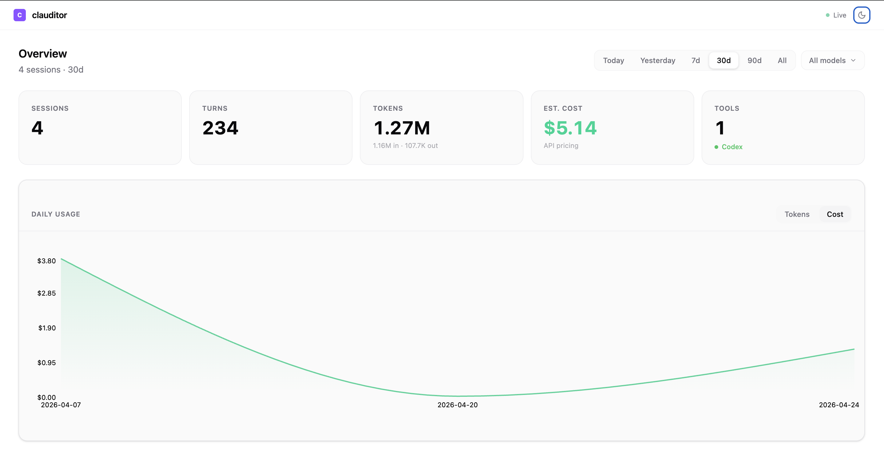
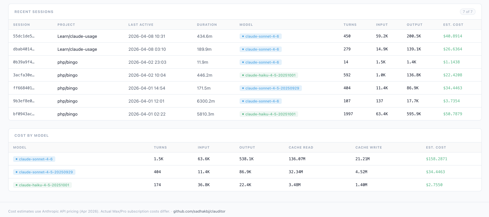
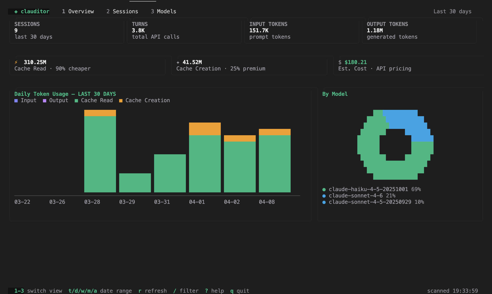

# clauditor

Claude.ai shows you a usage bar. **Clauditor shows you everything else.**

Which project burned through the most tokens this week? Which session cost $12 in one sitting? How much are you actually saving from prompt caching? Your Claude Code or Cursor subscription gives you none of this — clauditor does.

It parses the JSONL transcripts that Claude Code writes locally (and conversation data from Cursor's storage), stores them in a SQLite database on your machine, and gives you a terminal UI and web dashboard to explore your usage. No API key. No account. Completely offline.

Built for Claude Code **Pro and Max** subscribers and **Cursor** users who run AI tools all day across multiple projects and want to know where their usage is actually going.

---

## What you get that the tools don't show you

| | Claude.ai / Cursor | clauditor |
|---|---|---|
| Usage bar (% of limit) | ✓ | ✓ |
| Cost per session | ✗ | ✓ |
| Breakdown by project | ✗ | ✓ |
| Daily usage trends | ✗ | ✓ |
| Cache read vs creation savings | ✗ | ✓ |
| API-equivalent cost estimates | ✗ | ✓ |
| Model-by-model breakdown | ✗ | ✓ |
| **Multi-tool dashboard (Claude + Cursor)** | ✗ | ✓ |
| Works offline, no account | ✗ | ✓ |

---

## Installation

**With Go 1.25+**

```sh
go install github.com/sadhakbj/clauditor@latest
```

This installs the binary to `$GOPATH/bin` (usually `~/go/bin`). Run the same command to update to the latest version. Make sure that's on your `$PATH`:

```sh
export PATH="$PATH:$(go env GOPATH)/bin"
```

**Without Go** — download a pre-built binary for your platform from [GitHub Releases](https://github.com/sadhakbj/clauditor/releases) and put it somewhere on your `$PATH`.

---

## Quick start

No setup required. The database (`~/.claude/usage.db`) is created automatically on first run.

```sh
# Scan your transcripts and open the dashboard
clauditor dashboard

# Or use the terminal UI
clauditor tui

# Just check today's usage
clauditor today
```

---

## Usage

```
clauditor [command] [flags]
```

### Commands

| Command | Description |
|---------|-------------|
| `scan` | Parse JSONL transcripts (Claude) and Cursor data, write to the database |
| `today` | Print today's usage broken down by model |
| `stats` | Print all-time statistics |
| `dashboard` | Scan + start a local web dashboard |
| `tui` | Launch the interactive terminal UI |

### Global flags

| Flag | Default | Description |
|------|---------|-------------|
| `--db` | `~/.claude/usage.db` | Path to the SQLite database |
| `--dir` | `~/.claude/projects` | Path to Claude projects directory |
| `--cursor-dir` | *(platform default)* | Path to Cursor user-data directory |

The default Cursor data directory is:

| OS | Default path |
|----|-------------|
| macOS | `~/Library/Application Support/Cursor` |
| Linux | `~/.config/Cursor` (or `$XDG_CONFIG_HOME/Cursor`) |
| Windows | `%APPDATA%\Cursor` |

### Dashboard flags

| Flag | Default | Description |
|------|---------|-------------|
| `--port` | `8080` | Port for the web dashboard |
| `--no-browser` | `false` | Don't open the browser automatically |

---

## Web dashboard

Runs at `http://localhost:8080`. Shows:

- **Tools summary**: cards for each detected tool (Claude, Cursor) with sessions, turns, tokens and cost at a glance
- KPIs: sessions, turns, input/output tokens, cache usage, estimated cost
- Daily token usage (stacked: input / output / cache read / cache creation)
- Breakdown by model
- Top projects by cost
- Session table (with Tool and Model columns)

Filter by **tool** (All / Claude / Cursor), **model**, and **date range** (today / 7d / 30d / 90d / all time). Refreshes automatically every 60 seconds — no page reload.





## Terminal UI

```sh
clauditor tui
```



| Key | Action |
|-----|--------|
| `1` / `2` / `3` | Overview / Sessions / Models |
| `tab` | Cycle views |
| `t / d / w / m / a` | Date range: today / 7d / 30d / 90d / all |
| `j / k` or `↑ / ↓` | Scroll / navigate |
| `r` | Re-scan and refresh |
| `/` | Filter sessions |
| `?` | Help |
| `q` | Quit |

---

## How it works

### Claude Code

Claude Code writes every conversation as a JSONL file under `~/.claude/projects/`. Each line is a turn — it includes the model used, input tokens, output tokens, and cache token counts.

### Cursor

Cursor stores conversation data in SQLite state databases under its user-data directory (`User/workspaceStorage/*/state.vscdb` and `User/globalStorage/state.vscdb`). Clauditor reads the AI chat conversation records from those databases and normalises them into the same turn/session structure.

Both sources are tagged with a `source` field (`claude` or `cursor`) in the shared SQLite database so they can be viewed together or filtered independently.

Nothing leaves your machine.

---

## Cost estimates

Estimated using Anthropic API pricing (April 2026). Your subscription cost is different — these numbers show what the same usage would cost on the pay-as-you-go API, which is useful if you're evaluating whether Claude Code is worth it for your team, or comparing projects by spend.

| Model | Input | Output | Cache write | Cache read |
|-------|-------|--------|-------------|------------|
| Opus 4.x | $6.15/M | $30.75/M | $7.69/M | $0.61/M |
| Sonnet 4.x | $3.69/M | $18.45/M | $4.61/M | $0.37/M |
| Haiku 4.x | $1.23/M | $6.15/M | $1.54/M | $0.12/M |

Cursor sessions that use non-Claude models (e.g. GPT-4o) are recorded but cost is shown as `—` since no pricing data is configured for those models.

---

## Tech

- Pure Go, single static binary (no CGo)
- SQLite via [`modernc.org/sqlite`](https://pkg.go.dev/modernc.org/sqlite)
- CLI via [Cobra](https://github.com/spf13/cobra)
- Terminal UI via [Bubble Tea](https://github.com/charmbracelet/bubbletea) + [ntcharts](https://github.com/NimbleMarkets/ntcharts)
- Web dashboard: Vue 3 + [Chart.js](https://www.chartjs.org/) (embedded in binary)
- Releases via [GoReleaser](https://goreleaser.com/) + GitHub Actions
